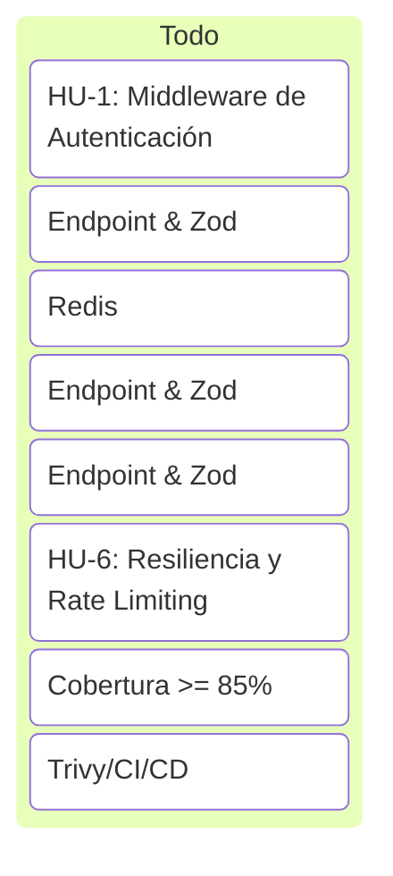

# Historias de Usuario — Geolocalización y Rutas (P25)

Este documento divide la implementación del microservicio de **Geolocalización y Rutas** en Historias de Usuario (HU) lógicas, secuenciales e incrementales, diseñadas para guiar el desarrollo paso a paso y cumplir con los criterios de aceptación técnicos y no funcionales del bootcamp.

---

## 🗺️ Backlog de Historias de Usuario

---

## 📑 Detalle de Historias de Usuario

### HU-1: Middleware de Autenticación de la API
**Como** consumidor del microservicio (Sistema de Gestión de Envíos),  
**Quiero** que todas las peticiones a los endpoints geográficos requieran un token de autorización en el header HTTP,  
**Para** garantizar que sólo los sistemas autorizados puedan consultar la información geográfica y de rutas.

*   **Criterios de Aceptación:**
    *   **Caso Exitoso:** Si la petición incluye un header `Authorization: Bearer <token_valido>`, la petición es procesada correctamente.
    *   **Caso Sin Token:** Si el header `Authorization` está ausente o no tiene el formato `Bearer`, la API responde de inmediato con código `401 Unauthorized` y un mensaje claro: `{"success": false, "message": "Unauthorized: Token is missing or invalid."}`.
    *   **Caso Token Inválido:** Si el token enviado no coincide con el token configurado, la API responde con `401 Unauthorized`.
*   **Tareas Técnicas:**
    *   Crear `src/middleware/auth.middleware.js`.
    *   Configurar la variable de entorno `AUTH_TOKEN` en `.env`.
    *   Implementar test unitarios para validar la interceptación en rutas protegidas.

---

### HU-2: Geocodificación de Direcciones (Endpoint `/geo/geocode`)
**Como** despachador de envíos,  
**Quiero** enviar una dirección en texto plano y obtener sus coordenadas exactas (latitud y longitud),  
**Para** poder posicionarla correctamente en el mapa para su posterior ruteo.

*   **Criterios de Aceptación:**
    *   **Caso Exitoso:** Al enviar un `POST` a `/api/v1/geo/geocode` con un JSON `{"address": "Av. América 123, Cochabamba, Bolivia"}`, la API retorna `200 OK` y las coordenadas `latitude` y `longitude` correspondientes.
    *   **Caso Dirección Vacía:** Si la propiedad `address` se envía vacía (`""`), nula o ausente, la API responde con `400 Bad Request` y el JSON `{"success": false, "message": "Address is required."}`.
*   **Tareas Técnicas:**
    *   Definir el esquema Zod `geocodeSchema` en `src/schemas/geo.schema.js`.
    *   Crear el modelo de dominio `Punto.js` (validando rangos de latitud y longitud) y `Direccion.js` (validando dirección no vacía).
    *   Implementar `geo.controller.js` y asociar la ruta `/geo/geocode` con el esquema y el middleware de autenticación.

---

### HU-3: Caché con Patrón Cache-Aside (Redis)
**Como** administrador de la plataforma,  
**Quiero** que los resultados de geocodificación se almacenen en una caché temporal (Redis) usando un TTL configurable,  
**Para** evitar realizar llamadas repetitivas e innecesarias al proveedor de mapas externo, reduciendo costos y tiempos de respuesta.

*   **Criterios de Aceptación:**
    *   **Cache Miss:** La primera vez que se consulta una dirección, se llama al proveedor de mapas, se obtienen las coordenadas y se guardan en Redis.
    *   **Cache Hit:** En consultas posteriores de la misma dirección exacta, las coordenadas se sirven desde Redis sin invocar al proveedor de mapas.
    *   **Resiliencia de Caché:** Si la caché Redis está caída, la API debe registrar una advertencia (*warning*) y continuar consultando directamente al proveedor de mapas sin interrumpir el servicio.
*   **Tareas Técnicas:**
    *   Crear adaptador de caché integrando `@tigo/redis-connector`.
    *   Configurar la variable de entorno `GEO_CACHE_TTL` para regular la expiración.
    *   Escribir pruebas simulando aciertos (*hit*) y fallos (*miss*) de caché.

---

### HU-4: Cálculo de Rutas Terrestres (Endpoint `/geo/route`)
**Como** conductor del camión de entregas,  
**Quiero** enviar un punto de origen y un punto de destino mediante coordenadas geográficas,  
**Para** obtener el listado detallado de puntos geográficos (path), la distancia total en kilómetros y la duración estimada.

*   **Criterios de Aceptación:**
    *   **Caso Exitoso:** Al enviar `POST` a `/api/v1/geo/route` con origen y destino válidos, retorna la ruta con distancia en km, duración en minutos y un array `path` con los puntos del trayecto.
    *   **Caso Coordenadas Fuera de Rango:** Si alguna latitud no está entre `[-90, 90]` o longitud entre `[-180, 180]`, el sistema valida y responde con `400 Bad Request`.
*   **Tareas Técnicas:**
    *   Definir esquema Zod para origen/destino y coordenadas de punto.
    *   Implementar el modelo `Ruta.js` en el dominio.
    *   Integrar la llamada al ruteador del proveedor de mapas en `geo.service.js`.

---

### HU-5: Cálculo de Distancia y Tiempo de Viaje (Endpoint `/geo/distance`)
**Como** planificador de rutas,  
**Quiero** calcular la distancia y la duración estimada de viaje entre dos coordenadas sin recibir la lista completa de puntos geográficos del camino,  
**Para** optimizar el consumo de ancho de banda y agilizar los cálculos de tiempos de entrega masivos.

*   **Criterios de Aceptación:**
    *   **Caso Exitoso:** Al enviar `POST` a `/api/v1/geo/distance` con origen y destino, la API responde con la distancia y duración en formato simplificado (numérico o texto formateado).
*   **Tareas Técnicas:**
    *   Implementar endpoint en `geo.controller.js` mapeando al servicio correspondiente.
    *   Asegurar que la carga de respuesta no incluya el campo pesado `path`.

---

### HU-6: Tolerancia a Fallos y Limitación de Tasa (Rate Limiting)
**Como** administrador de la plataforma,  
**Quiero** limitar la cantidad de peticiones concurrentes y reintentar automáticamente las consultas al proveedor de mapas ante caídas transitorias,  
**Para** evitar la saturación de nuestra clave de API externa y garantizar la alta disponibilidad del sistema.

*   **Criterios de Aceptación:**
    *   **Rate Limiting:** Si una IP excede la tasa permitida de peticiones en un lapso de 15 minutos, responde con `429 Too Many Requests`.
    *   **Retry Policy:** Ante una desconexión o fallo 5xx temporal del proveedor de mapas, el sistema reintenta la petición hasta 3 veces utilizando un retraso exponencial (*Exponential Backoff*) antes de reportar un error al cliente.
*   **Tareas Técnicas:**
    *   Configurar `express-rate-limit` en las rutas del microservicio.
    *   Implementar la función de reintento exponencial en `geo.service.js`.

---

### HU-7: Calidad y Pruebas Unitarias (Cobertura >= 85%)
**Como** desarrollador del proyecto,  
**Quiero** disponer de una suite completa de pruebas automatizadas con cobertura total del negocio,  
**Para** garantizar la estabilidad de los flujos principales y cumplir con las métricas de calidad obligatorias del bootcamp.

*   **Criterios de Aceptación:**
    *   La cobertura total de código reportada por Vitest (`npm run coverage`) debe ser mayor o igual a **85%**.
    *   Se deben mockear los conectores externos de Redis y mapas para evitar dependencias durante la ejecución en el pipeline.
*   **Tareas Técnicas:**
    *   Crear suite de pruebas unitarias en `test/unit-test/` para los modelos de dominio, servicios y controladores.

---

### HU-8: Pruebas de Carga K6 y Seguridad (Despliegue CI/CD)
**Como** oficial de seguridad y QA,  
**Quiero** automatizar la ejecución de análisis estático (SAST), escaneo de contenedores (Trivy) y pruebas de carga (K6) dentro del pipeline de Jenkins,  
**Para** certificar que el microservicio es seguro y responde en menos de 500 ms en el percentil 95 (p95).

*   **Criterios de Aceptación:**
    *   **Pruebas de Carga (K6):** La métrica `p95` del tiempo de respuesta HTTP de geocodificación debe ser **≤ 500 ms** bajo carga constante de usuarios virtuales con una tasa de error **< 1%**.
    *   **Seguridad:** El escaneo con Trivy sobre la imagen Docker resultante no debe registrar hallazgos críticos ni altos.
*   **Tareas Técnicas:**
    *   Crear archivo Dockerfile multi-stage basado en imágenes Node Alpine.
    *   Escribir script de K6 `load_test.js` para simulación de usuarios virtuales.
    *   Configurar el pipeline en `Jenkinsfile`.
