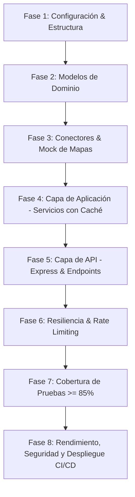

# Planificación de Implementación — Geolocalización y Rutas (P25)

Esta planificación detalla el proceso paso a paso para implementar el microservicio de **Geolocalización y Rutas** utilizando **Node.js y Express (JavaScript ESM)** de acuerdo con la descripción de funcionamiento y los requisitos oficiales (P25 y comunes del bootcamp).

---

## 🗺️ Mapa de Ruta General



---

## 🛠️ Fase 1: Configuración del Proyecto y Estructura

En esta fase se valida y ajusta la estructura de directorios existente siguiendo los principios de Clean Architecture y la convención de módulos nativos de JavaScript (`ESM`).

### 1. Dependencias del Proyecto
Se mantiene la configuración nativa de Node.js en `package.json` con `"type": "module"`. Las dependencias clave para validación y pruebas son:
* `ultimate-express` como framework.
* `zod` para validación de entrada.
* `@tigo/redis-connector` para la caché.
* `vitest` para pruebas unitarias.

### 2. Estructura de Directorios

```text
src/
├── config/             # Configuración general (.env, logs)
├── domain/             # Entidades y reglas lógicas del negocio
│   ├── Punto.js
│   ├── Direccion.js
│   └── Ruta.js
├── services/           # Servicios de negocio coordinadores
│   └── geo.service.js
├── controllers/        # Controladores que manejan HTTP requests
│   └── geo.controller.js
├── middleware/         # Middlewares (autenticación, validación Zod)
│   ├── auth.middleware.js
│   └── validate.middleware.js
├── routes/             # Enrutador de Express
│   └── router.routes.js
└── app.js
```

---

## 📐 Fase 2: Modelos de Dominio

Implementar las clases en JavaScript que manejan las reglas del negocio de manera aislada de Express.

### `src/domain/Punto.js` (Validación de rangos)
```javascript
export class Punto {
  constructor(latitude, longitude) {
    this.latitude = Number(latitude);
    this.longitude = Number(longitude);
    
    if (!this.esValido()) {
      throw new Error(`Coordenadas fuera de rango válido (-90 a 90, -180 a 180): lat=${latitude}, lng=${longitude}`);
    }
  }

  esValido() {
    return (
      !isNaN(this.latitude) &&
      !isNaN(this.longitude) &&
      this.latitude >= -90 &&
      this.latitude <= 90 &&
      this.longitude >= -180 &&
      this.longitude <= 180
    );
  }
}
```

### `src/domain/Direccion.js` (Validación de dirección no vacía)
```javascript
import { Punto } from './Punto.js';

export class Direccion {
  constructor(address, coordenadas = null) {
    this.address = address;
    this.coordenadas = coordenadas;
    
    if (this.esVacia()) {
      throw new Error("Address is required.");
    }
  }

  esVacia() {
    return !this.address || this.address.trim().length === 0;
  }
}
```

---

## 🔌 Fase 3: Conectores e Infraestructura

En JavaScript, el conector a la caché Redis se obtiene directamente de `@tigo/redis-connector`. El cliente para el proveedor de mapas se integrará mediante un adaptador flexible.

### Adaptador de Caché con `@tigo/redis-connector`
El SDK provee las funciones `getRedisClient()`, por lo que implementamos el helper:

```javascript
import { getRedisClient } from '@tigo/redis-connector';

export class RedisCacheAdapter {
  constructor() {
    this.client = getRedisClient();
  }

  async get(clave) {
    const raw = await this.client.get(`geo:geocode:${clave}`);
    if (!raw) return null;
    return JSON.parse(raw);
  }

  async set(clave, valor, ttlSeconds) {
    await this.client.set(
      `geo:geocode:${clave}`,
      JSON.stringify(valor),
      'EX',
      ttlSeconds
    );
  }
}
```

---

## 🧠 Fase 4: Servicios de Aplicación (Cache-Aside con TTL Configurable)

Implementar el servicio que aplica la lógica *Cache-Aside* y la tolerancia a fallos con reintentos.

### `src/services/geo.service.js`
```javascript
import { Direccion } from '../domain/Direccion.js';
import { Punto } from '../domain/Punto.js';

export class GeoService {
  constructor(mapConnector, cacheConnector) {
    this.mapConnector = mapConnector;
    this.cacheConnector = cacheConnector;
    this.TTL_CACHE = parseInt(process.env.GEO_CACHE_TTL || '86400', 10);
  }

  async geocodificar(address) {
    const direccionInput = new Direccion(address);

    // 1. Intentar leer de caché (Cache-Aside)
    try {
      const cachedCoords = await this.cacheConnector.get(address);
      if (cachedCoords) {
        return new Direccion(address, new Punto(cachedCoords.latitude, cachedCoords.longitude));
      }
    } catch (error) {
      console.warn("Fallo al leer de la caché, continuando con consulta directa...", error);
    }

    // 2. Consulta con Retry Policy ante caídas del proveedor
    const coordenadas = await this.ejecutarConReintentos(() => 
      this.mapConnector.geocode(address)
    );

    const puntoResultado = new Punto(coordenadas.latitude, coordenadas.longitude);

    // 3. Escribir en caché de forma asíncrona
    try {
      await this.cacheConnector.set(address, puntoResultado, this.TTL_CACHE);
    } catch (error) {
      console.warn("Fallo al escribir en la caché...", error);
    }

    return new Direccion(address, puntoResultado);
  }

  async ejecutarConReintentos(fn, reintentos = 3, retraso = 1000) {
    try {
      return await fn();
    } catch (error) {
      if (reintentos <= 0) throw error;
      console.log(`Reintentando en ${retraso}ms... (${reintentos} restantes)`);
      await new Promise(resolve => setTimeout(resolve, retraso));
      return this.ejecutarConReintentos(fn, reintentos - 1, retraso * 2);
    }
  }
}
```

---

## 🛣️ Fase 5: Capa de API y Validaciones Zod

Implementar los controladores y esquemas de validación Zod en `src/schemas/` y configurar las rutas en `src/routes/router.routes.js`.

### Middleware de Validación Zod (`src/middleware/validate.middleware.js`)
```javascript
import { ZodError } from 'zod';

export const validateRequest = (schema) => (req, res, next) => {
  try {
    schema.parse(req.body);
    next();
  } catch (error) {
    if (error instanceof ZodError) {
      return res.status(400).json({
        success: false,
        message: error.errors[0].message
      });
    }
    next(error);
  }
};
```

---

## 🛡️ Fase 6: Middleware de Autenticación y Rate Limiting

### `src/middleware/auth.middleware.js`
```javascript
export const authMiddleware = (req, res, next) => {
  const authHeader = req.headers['authorization'];
  if (!authHeader || !authHeader.startsWith('Bearer ')) {
    return res.status(401).json({
      success: false,
      message: "Unauthorized: Token is missing or invalid."
    });
  }
  
  const token = authHeader.split(' ')[1];
  // Simulación o verificación JWT en producción
  if (token !== process.env.AUTH_TOKEN) {
    return res.status(401).json({
      success: false,
      message: "Unauthorized: Invalid token."
    });
  }

  next();
};
```

---

## 🧪 Fase 7: Pruebas Unitarias con Vitest (Cobertura >= 85%)

Implementar las pruebas unitarias usando `vitest` para garantizar la cobertura de negocio y simular fallos del proveedor.

```bash
# Ejecución de pruebas y reporte de cobertura
npm run test
npm run coverage
```

---

## ⚡ Fase 8: Rendimiento, Seguridad y Despliegue CI/CD

Esta fase incorpora las especificaciones comunes y obligatorias del bootcamp:

### 1. Pruebas de Rendimiento con K6
Script para simular carga y validar los umbrales: `p95 <= 500 ms` y `tasa de error < 1%`.

### 2. Contenedor Docker y Análisis Trivy
Generar el `Dockerfile` optimizado y validar con Trivy.

### 3. Pipeline Jenkins
Configurar el pipeline de CI/CD para automatizar análisis SAST, DAST, test coverage y despliegue continuo en Dev y QA.
